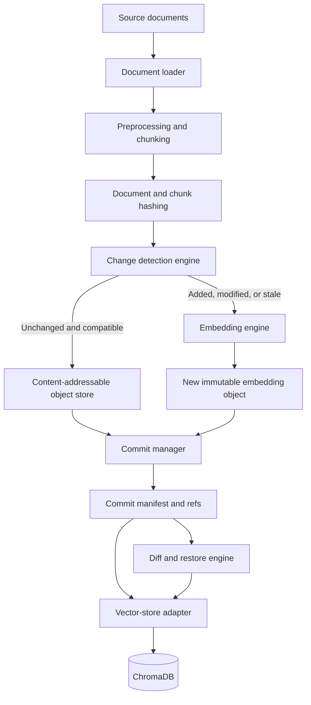
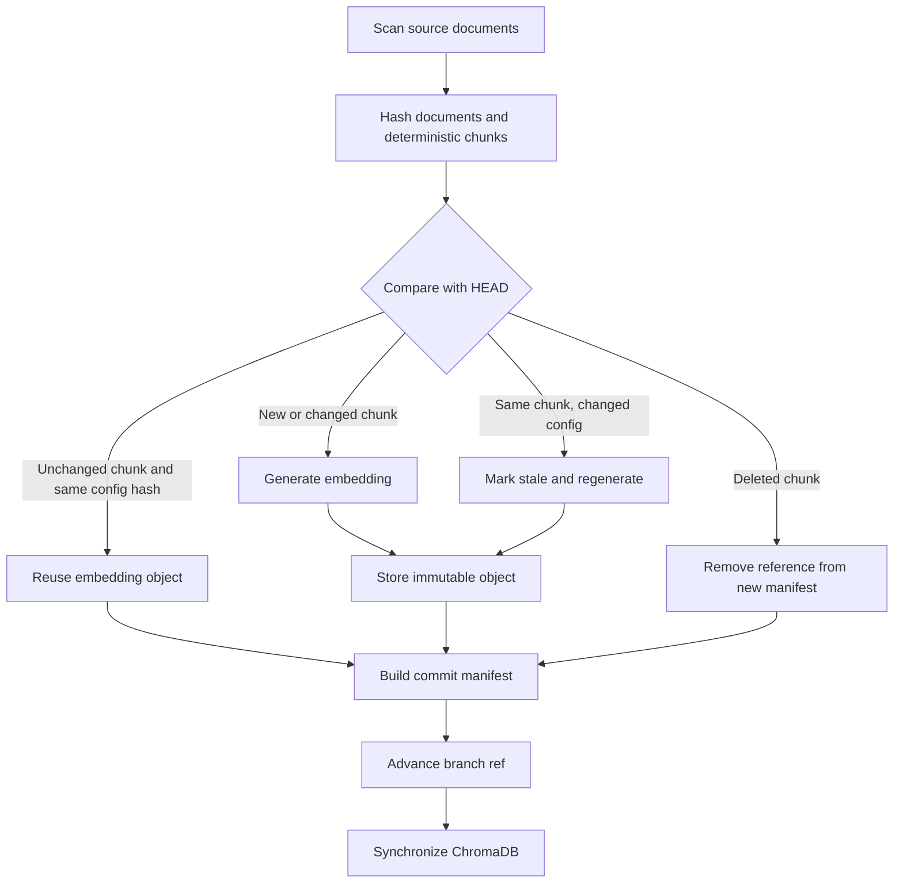

# EmbedGit

> **Git-inspired version control and incremental lifecycle management for vector embeddings**

[](#project-status)
[](#installation)
[](#technology-stack)
[](#license)

EmbedGit is a proposed lightweight version-control system for embedding collections. It tracks the relationship between source documents, deterministic chunks, embedding configuration, immutable vector objects, commits, and a synchronized vector store. Its goal is to avoid re-embedding unchanged content while making embedding datasets comparable, restorable, and reproducible.

The project is both a practical AI/cloud-engineering prototype and a research investigation. The semester MVP targets a local, single-user workflow with one Sentence Transformers model and ChromaDB. It is inspired by Git's content-addressable design, but **does not replace Git**: Git should continue to manage source code, while EmbedGit manages large embedding artifacts and their provenance.

> **Project status:** this repository currently contains the project specification and documentation. Commands and APIs below define the intended MVP interface; implementation results and benchmark values must be added only after they are measured.

## Table of contents

- [Why EmbedGit?](#why-embedgit)
- [Problem statement](#problem-statement)
- [Research questions](#research-questions)
- [Objectives and scope](#objectives-and-scope)
- [Key terminology](#key-terminology)
- [Git-to-embedding mapping](#git-to-embedding-mapping)
- [Architecture](#architecture)
- [Workflow](#workflow)
- [Core components](#core-components)
- [Versioning and invalidation rules](#versioning-and-invalidation-rules)
- [Installation](#installation)
- [Quick start](#quick-start)
- [Configuration](#configuration)
- [Repository structure](#repository-structure)
- [Experimental methodology](#experimental-methodology)
- [Expected results](#expected-results)
- [Semester roadmap](#semester-roadmap)
- [Limitations](#limitations)
- [Future enhancements](#future-enhancements)
- [Research contribution](#research-contribution)
- [Ethical and practical considerations](#ethical-and-practical-considerations)
- [Contributing](#contributing)
- [License](#license)

## Why EmbedGit?

Semantic search, recommendation, document retrieval, vector databases, and Retrieval-Augmented Generation (RAG) depend on embeddings. These vectors change whenever source content, metadata, preprocessing, chunking, tokenizer settings, or the embedding model changes. Many teams respond by rebuilding an entire collection, overwriting the current vectors, or maintaining ad hoc database collections.

For a knowledge base with hundreds of thousands of chunks, re-embedding everything after a small edit wastes time, compute, energy, and API cost. EmbedGit instead asks: what changed, which vectors are stale, which objects are safe to reuse, and what metadata is needed to reproduce the resulting state?

### Illustrative university-notes use case

Assume a RAG knowledge base contains 10,000 documents, 100,000 chunks, and 100,000 embeddings. A student edits 50 documents:

- Full regeneration may recreate all 100,000 embeddings.
- Document-level regeneration recreates every chunk belonging to those 50 documents.
- Chunk-level EmbedGit tracking recreates only chunks whose normalized content or effective configuration changed.

The next commit references newly generated objects and reuses unchanged objects from its parent, reducing computation and avoiding duplicate storage.

## Problem statement

Embedding-based systems lack a general-purpose, standardized mechanism for tracking source changes, identifying stale vectors, incrementally regenerating affected embeddings, comparing versions, restoring prior states, reproducing datasets, synchronizing vector-store state, and measuring semantic or retrieval drift.

EmbedGit addresses this lifecycle problem with content hashes, immutable objects, configuration-aware invalidation, commit manifests, embedding-aware diffs, and vector-store adapters.

## Research questions

**Primary question**

> Can a Git-like version-control system reduce the time and computational cost of updating large embedding collections while preserving retrieval quality and reproducibility?

**Secondary questions**

1. How much time does incremental regeneration save compared with full regeneration?
2. What storage overhead results from retaining multiple versions?
3. How reliably can stale embeddings be detected?
4. Which artifacts and environment details are required to reproduce a commit?
5. How should the system respond to model, tokenizer, preprocessing, or chunking changes?
6. Can semantic and retrieval drift be measured meaningfully between commits?
7. When is reuse safe, and when is regeneration mandatory?
8. How do incremental updates affect Recall@K, MRR, NDCG@K, and ranking stability?
9. Can related vector spaces be aligned without sacrificing retrieval quality?

## Objectives and scope

### Semester MVP

- Initialize and validate a local embedding repository.
- Ingest plain text, Markdown, and PDF files.
- Extract, normalize, and deterministically chunk content.
- Compute SHA-256 hashes for documents, chunks, configurations, and objects.
- Detect added, modified, deleted, unchanged, and stale chunks.
- Generate embeddings with one pinned Sentence Transformers model.
- Store immutable embedding objects and reuse identical objects across commits.
- Create commits, inspect history, compare commits, and restore earlier states.
- Synchronize the checked-out commit with a persistent ChromaDB collection.
- Expose the workflow through a Python CLI.
- Benchmark full, document-level, and chunk-level regeneration.
- Evaluate efficiency, reproducibility, storage overhead, and retrieval quality.

### Explicitly out of scope for the MVP

Distributed storage, multi-user collaboration, authentication, fault tolerance, GPU-cluster execution, production hosting, complex vector-delta compression, and guaranteed cross-model vector alignment are not semester-MVP requirements.

## Key terminology

- **Source document:** an input file and its metadata before embedding.
- **Normalized chunk:** deterministic text produced by a pinned extraction, preprocessing, and chunking pipeline.
- **Document hash:** SHA-256 fingerprint of source content, used for fast document-level change detection.
- **Chunk hash:** SHA-256 fingerprint of normalized chunk content plus the preprocessing and chunking configuration that defines it.
- **Embedding configuration hash:** fingerprint of model identity/revision, tokenizer, pooling, normalization, vector dimension, preprocessing, and chunking settings.
- **Embedding object:** immutable vector plus its chunk hash, configuration fingerprint, provenance, and creation metadata.
- **Commit:** immutable manifest that references documents, chunks, embedding objects, configuration, parent commit, statistics, and timestamp.
- **Stale embedding:** an embedding whose chunk text is unchanged but whose effective embedding configuration changed.
- **Working state:** current documents and configuration before a commit.
- **Vector-store state:** the materialized database collection corresponding to a checked-out commit.

## Git-to-embedding mapping

| Git concept | EmbedGit analogue | Meaning |
|---|---|---|
| Repository | Embedding repository | Documents, configuration, objects, refs, commits, and vector-store metadata |
| Blob/object | Chunk or embedding object | Immutable content-addressed data stored once and shared by commits |
| Index/staging area | Tracked working state | Added, modified, deleted, unchanged, and stale items awaiting a commit |
| Commit | Embedding snapshot | Manifest referencing exact chunks, vectors, configuration, and parent |
| Branch | Experiment line | Isolated work with a model, chunking method, preprocessing, or retrieval strategy |
| `status` | Change classification | Explains document/chunk changes and required regeneration |
| `diff` | Structural, vector, and retrieval comparison | Reports provenance, configuration, semantic, storage, and top-k changes |
| `checkout` / `restore` | Snapshot materialization | Restores configuration and object references, then synchronizes the vector store |

These are selected Git ideas adapted to embeddings. EmbedGit initially deduplicates whole immutable objects; it does not attempt Git-style textual deltas between floating-point vectors.

## Architecture



The design uses an adapter boundary so FAISS, Qdrant, Pinecone, Milvus, or Weaviate can be supported later without changing commit semantics.

## Workflow



## Core components

1. **Repository Manager** - initializes `.embedgit`, validates configuration, and manages refs, branches, HEAD, and history.
2. **Document Tracker** - scans sources, records metadata, hashes content, and detects additions, modifications, and deletions.
3. **Chunking Engine** - extracts text, normalizes it, produces deterministic chunks and IDs, and retains source-to-chunk mappings.
4. **Embedding Engine** - loads the pinned model, batches new/stale chunks, normalizes vectors, and records model provenance.
5. **Change Detection Engine** - classifies chunks as `ADDED`, `MODIFIED`, `DELETED`, `UNCHANGED`, or `STALE`.
6. **Object Store** - persists immutable chunk, embedding, configuration, and manifest objects by content hash.
7. **Commit Manager** - builds snapshots that reference objects instead of duplicating them.
8. **Vector Store Adapter** - applies the checked-out commit to ChromaDB and exposes a backend-neutral interface.
9. **Diff Engine** - compares structure, configuration, embeddings, storage, and retrieval behavior.
10. **Restore Engine** - restores commit/configuration references and safely rematerializes vector-store state.

## Versioning and invalidation rules

Reuse is intentionally conservative:

```text
reusable = (chunk_hash == previous.chunk_hash)
           AND (embedding_config_hash == previous.embedding_config_hash)
           AND object_integrity_verified
```

| Condition | Classification | Required action |
|---|---|---|
| Same normalized chunk + same embedding configuration | `UNCHANGED` | Reuse the existing embedding object |
| Changed chunk + same embedding configuration | `MODIFIED` | Regenerate that affected chunk |
| New chunk | `ADDED` | Generate a new embedding |
| Removed chunk | `DELETED` | Omit its reference and delete/suppress it during vector-store sync |
| Same chunk + changed effective configuration | `STALE` | Regenerate before committing a valid snapshot |
| Embedding model changed | Major version / experiment branch | Regenerate the collection; never blindly mix vector spaces |

Even models with equal dimensionality can encode different semantic spaces. Complete regeneration is therefore the correctness baseline for a model change. Alignment of old and new spaces is only an optional research experiment.

### What is versioned?

EmbedGit explicitly distinguishes four related states:

1. **Source-document versions** - file content and metadata tracked through document hashes and manifests.
2. **Embedding-object versions** - immutable, content-addressed vectors with model and chunk provenance.
3. **Vector-database state** - a materialized ChromaDB view synchronized from one commit; it is not itself the canonical history.
4. **Embedding-model configuration** - pinned model/revision, tokenizer, dimension, pooling, normalization, preprocessing, and chunking fingerprints.

## Technology stack

| Area | MVP choice |
|---|---|
| Language and CLI | Python 3.11+, Typer (or Click) |
| Embeddings | Sentence Transformers; `BAAI/bge-small-en-v1.5` initially |
| Vector store | ChromaDB |
| Hashing | SHA-256 |
| Metadata | JSON for the first implementation; SQLite is a compatible evolution |
| Object storage | Local filesystem |
| Document loading | PyMuPDF, Markdown, and plain text loaders |
| Validation and tests | Pydantic and Pytest |
| Optional interface | Streamlit dashboard |
| Packaging | `pyproject.toml` and Docker |

## Installation

> The package scaffold is planned but not yet present in this repository. Once the MVP source is added, the intended developer setup is:

```bash
git clone <repository-url>
cd embedgit

python -m venv .venv

# Linux/macOS
source .venv/bin/activate

# Windows PowerShell
.venv\Scripts\Activate.ps1

python -m pip install --upgrade pip
python -m pip install -e ".[dev]"
embedgit --help
```

Model weights are downloaded by Sentence Transformers on first use. For reproducible experiments, pin both Python dependencies and the exact model revision. Docker instructions will be added with the implementation.

## Quick start

The following illustrates the proposed MVP CLI:

```bash
# Initialize a repository and configure the pipeline
mkdir student-notes-rag && cd student-notes-rag
embedgit init
embedgit config set model BAAI/bge-small-en-v1.5
embedgit config set model_revision <pinned-revision>
embedgit config set chunk_size 500
embedgit config set chunk_overlap 50

# Track, inspect, embed, and commit documents
embedgit add ./documents
embedgit status
embedgit embed
embedgit commit -m "Initial knowledge-base embeddings"

# Make changes, then create an incremental snapshot
embedgit add ./documents
embedgit status
embedgit embed
embedgit commit -m "Update operating-systems notes"

# Inspect and compare history
embedgit log
embedgit diff HEAD~1 HEAD

# Restore a prior state or create an experiment branch
embedgit checkout <commit-id>
embedgit branch minilm-experiment
embedgit checkout minilm-experiment

# Run the controlled benchmark suite
embedgit benchmark
```

Expected `status` output should summarize modified, added, and deleted documents together with unchanged, stale, and regeneration-required chunk counts.

## Configuration

Example `embedgit.yaml`:

```yaml
repository:
  name: student-notes-rag
  schema_version: 1

embedding:
  provider: sentence-transformers
  model: BAAI/bge-small-en-v1.5
  revision: <pinned-model-revision>
  dimension: 384
  normalize_embeddings: true
  pooling: model-default

chunking:
  strategy: recursive-character
  chunk_size: 500
  chunk_overlap: 50

preprocessing:
  lowercase: false
  remove_extra_whitespace: true
  unicode_normalization: NFKC

vector_store:
  provider: chromadb
  collection: student-notes
  persist_directory: ./vector_store
```

Changing any field that contributes to the effective embedding configuration must change `embedding_config_hash` and invalidate affected vectors.

### Commit manifest sketch

```json
{
  "commit_id": "91b7e92",
  "parent_commit": "73ac120",
  "message": "Updated operating systems notes",
  "timestamp": "2026-08-04T12:00:00Z",
  "embedding_config_hash": "config123",
  "documents": {
    "os/chapter1.pdf": {
      "document_hash": "doc123",
      "chunks": [
        {
          "chunk_id": "chunk-001",
          "chunk_hash": "chunkhash001",
          "embedding_object": "embedobj001"
        }
      ]
    }
  },
  "statistics": {
    "documents_modified": 1,
    "chunks_reused": 92,
    "chunks_regenerated": 8
  }
}
```

## Repository structure

```text
embedgit/
|-- README.md
|-- pyproject.toml
|-- requirements.txt
|-- Dockerfile
|-- embedgit.yaml
|-- src/embedgit/
|   |-- cli.py
|   |-- config.py
|   |-- repository.py
|   |-- hashing.py
|   |-- document_loader.py
|   |-- chunking.py
|   |-- embedding_engine.py
|   |-- object_store.py
|   |-- change_detector.py
|   |-- commit_manager.py
|   |-- diff_engine.py
|   |-- restore_engine.py
|   |-- vector_store/
|   |   |-- base.py
|   |   `-- chromadb_adapter.py
|   `-- models/
|       |-- commit.py
|       |-- document.py
|       `-- embedding.py
|-- tests/
|   |-- test_hashing.py
|   |-- test_change_detection.py
|   |-- test_commits.py
|   `-- test_restore.py
|-- examples/student_notes_rag/
|-- benchmarks/
|   |-- generate_dataset.py
|   |-- run_full_regeneration.py
|   |-- run_incremental_regeneration.py
|   `-- evaluate_retrieval.py
`-- docs/
    |-- architecture.md
    |-- research_methodology.md
    `-- results.md
```

A user's initialized project contains `documents/`, `embedgit.yaml`, `vector_store/`, and a private `.embedgit/` directory with `config.json`, `index.json`, `objects/`, `commits/`, `refs/`, and `cache/`.

## Experimental methodology

The project must include controlled experiments, not only a CLI demonstration.

### Dataset and change scenarios

Create a document collection large enough to expose meaningful timing differences. From a fixed baseline commit, independently test:

- modifications to 1%, 5%, and 10% of documents;
- additions and deletions;
- metadata-only changes;
- chunk-size and chunk-overlap changes;
- preprocessing changes; and
- an embedding-model change.

Use seeded modifications and record the corpus checksum, dependency lockfile, model revision, hardware, operating system, and run configuration. Repeat timed runs, include warm-up runs where appropriate, and report summary statistics rather than a single favorable run.

### Baselines

1. **Full regeneration:** process and embed every document and chunk.
2. **Document-level incremental regeneration:** fully re-embed only documents detected as modified.
3. **Proposed method - chunk-level incremental regeneration:** embed only added, modified, or stale chunks.

All three strategies must operate on equivalent input and produce a comparable final vector-store state.

### Evaluation metrics

**Efficiency and cost**

- Total and embedding-generation time
- Vector-store update time
- Embedding-model calls
- Regenerated and reused vector counts
- CPU and peak memory usage
- Versioned storage overhead
- Estimated paid-API cost, when applicable

```text
Regeneration reduction = 1 - (regenerated chunks / total chunks)
Time saved             = full time - incremental time
Speedup                 = full time / incremental time
Embedding reuse rate   = reused embeddings / embeddings in new version
Storage overhead       = versioned storage - single-version storage
```

**Retrieval quality**

Using a labeled query set, measure Precision@K, Recall@K, Mean Reciprocal Rank, NDCG@K, top-k overlap, and ranking stability. When configuration is unchanged, an incremental update should produce the same or nearly the same results as full regeneration.

**Embedding and semantic drift**

For shared comparable chunks, report cosine similarity, Euclidean distance, nearest-neighbour consistency, and the share of vectors above a declared drift threshold. A useful exploratory statistic is `drift = 1 - cosine_similarity(old, new)`.

**Reproducibility**

Verify that checking out a commit recreates the same chunks, metadata, configuration, object references, and vector-store membership. Compare vectors within a declared numerical tolerance because exact floating-point equality can vary across hardware and library versions.

## Expected results

The hypothesis is that chunk-level regeneration will substantially reduce model calls and elapsed time when a small fraction of a corpus changes, while preserving retrieval quality under an unchanged configuration. Savings should decrease as the changed fraction grows. A model or incompatible preprocessing change should invalidate much or all of the collection.

No numerical speedup, storage, or retrieval claim is made before experiments are run. Final results should include raw measurements, uncertainty or variance, environment details, failure cases, and a comparison against both baselines.

## Semester roadmap

1. **Research and design** - review related tools, study Git object storage, and define schemas, commit semantics, and invalidation rules.
2. **Embedding pipeline** - implement ingestion, extraction, deterministic chunking, model execution, and ChromaDB persistence.
3. **Version-control core** - add hashes, status detection, immutable objects, commits, history, and incremental generation.
4. **Diff and restore** - compare commits, calculate drift, restore snapshots, and synchronize ChromaDB.
5. **Experiments** - generate controlled changes and compare full, document-level, and chunk-level strategies.
6. **Interface and documentation** - improve the CLI, optionally add Streamlit, document the design, and prepare the report/demo.
7. **Optional research extension** - test vector-space alignment against the full-regeneration correctness baseline.

## Limitations

- A model change normally requires complete regeneration; equal vector dimensions do not imply compatible spaces.
- Exact reproducibility can depend on model artifacts, hardware, numerical libraries, and dependency versions.
- PDF extraction can be unstable and may alter text or reading order across tools.
- Small edits can shift chunk boundaries and trigger more regeneration than expected.
- Chunk-level reuse depends on deterministic extraction, normalization, and chunking.
- Multiple versions introduce metadata and object-storage overhead.
- Semantic similarity alone does not guarantee equivalent retrieval rankings or RAG output.
- Vector-space alignment may fail for unrelated models and is not an MVP correctness mechanism.
- Local benchmarks may not represent distributed, concurrent, production workloads.
- External embedding APIs can change behavior across undocumented provider revisions.

## Future enhancements

- Remote repositories backed by S3, Google Cloud Storage, Azure Blob Storage, or MinIO
- Multi-user collaboration, concurrency control, authentication, and merge semantics
- Additional adapters for FAISS, Qdrant, Pinecone, Milvus, and Weaviate
- MLflow, Weights & Biases, DVC, and model-registry integrations
- Retrieval-aware diffs and automated semantic-drift alerts
- Float16/int8 storage, quantization, compressed snapshots, and safe delta encoding
- Branch merging with explicit model, chunking, content, and metadata-schema conflicts
- Optional alignment experiments using linear/ridge regression, orthogonal Procrustes, CCA, neural mappings, distillation, or contrastive learning
- Cloud deployment, observability, fault tolerance, and reproducibility across platforms

Any aligned-vector experiment must evaluate nearest-neighbour preservation, retrieval ranking, and downstream RAG quality against complete regeneration.

## Research contribution

EmbedGit does not claim to invent dataset versioning, vector databases, or embedding models. Its proposed contribution is a lightweight Git-inspired abstraction specifically for embedding collections, combining content-addressable storage, chunk-level change detection, safe embedding reuse, configuration-aware invalidation, embedding-aware diffs, vector-store synchronization, and reproducible snapshots.

The contribution is the lifecycle-management system and its empirical evaluation, not a new embedding model.

## Ethical and practical considerations

- **Privacy:** source documents and embeddings can encode sensitive information. Avoid committing private corpora; define retention and deletion procedures for objects and backups.
- **Security:** treat deserialized objects, model downloads, document parsers, and remote backends as trust boundaries. Verify hashes and pin dependencies/model revisions.
- **Licensing and consent:** confirm that source datasets and model weights permit storage, transformation, and redistribution.
- **Bias and quality:** version control improves traceability but does not remove bias, hallucination, or retrieval errors. Evaluate diverse queries and document failures.
- **Environmental impact:** report compute use honestly; incremental updates may reduce waste, but retained versions consume storage.
- **Reproducible reporting:** publish configurations, seeds, corpus construction, baselines, raw measurements, and negative results. Do not overstate local benchmark generality.

## Project status

**Design / MVP development.** The current scope, interfaces, and evaluation plan are defined. Implementation, automated tests, benchmark data, and release artifacts remain to be completed. Update this section as milestones are verified.

## Contributing

Contributions should remain compatible with the conservative reuse rule and semester-MVP scope.

1. Open an issue describing the problem, proposed behavior, and affected commit semantics.
2. Create a focused branch and include tests for normal, stale, deleted, and corrupted-object cases.
3. Run formatting, static checks, and `pytest` before submitting a pull request.
4. Document configuration or schema changes and provide a migration path.
5. For performance claims, include a reproducible benchmark command, environment metadata, raw results, and baseline comparison.

Avoid committing source datasets, generated model caches, `.embedgit/objects/`, or local `vector_store/` contents unless they are small, licensed test fixtures.

## License

**License placeholder:** select and add an open-source license (for example, Apache-2.0 or MIT) before public distribution. Third-party datasets, models, and dependencies retain their own licenses.

---

**EmbedGit manages embedding artifacts; Git continues to manage the code that creates them.**
